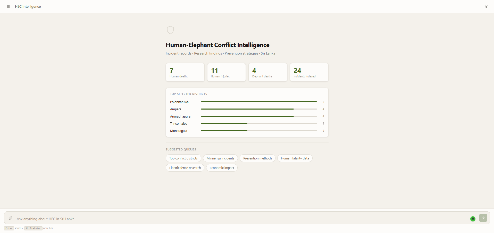
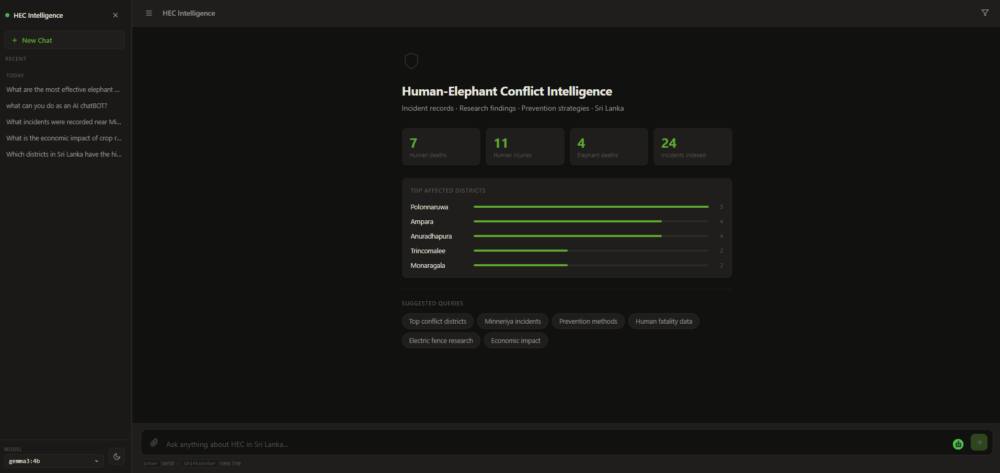
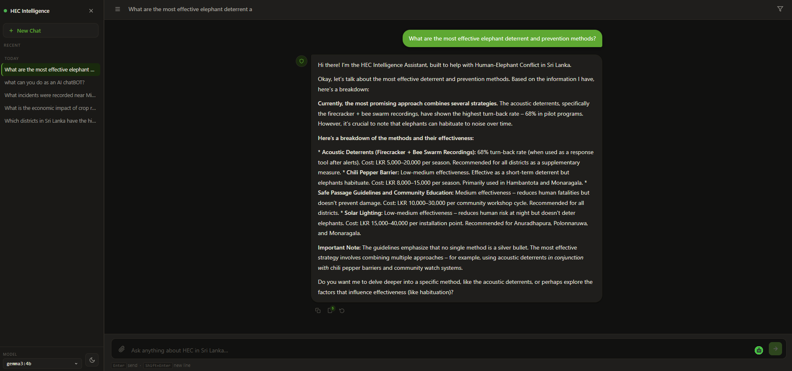
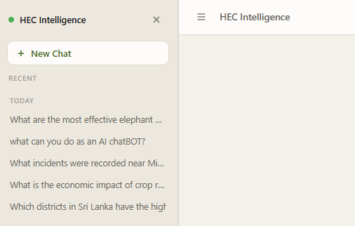

<div align="center">

# HEC Intelligence

### Human-Elephant Conflict AI Intelligence System · Sri Lanka

[](https://python.org)
[](https://fastapi.tiangolo.com)
[](https://ollama.com)
[](https://qdrant.tech)
[](https://developer.mozilla.org/en-US/docs/Web/JavaScript)
[](https://uom.lk)

<br/>

> An AI-powered intelligence platform for querying Human-Elephant Conflict incident data,
> research findings, and prevention strategies across Sri Lanka — through natural language.

**Developed by Team MetroMinds** · Department of Town and Country Planning · University of Moratuwa · 2026

</div>

---

## Screenshots

<table>
  <tr>
    <td align="center" width="50%">
      <strong>Welcome Screen · Light Mode</strong><br/><br/>
      
    </td>
    <td align="center" width="50%">
      <strong>Welcome Screen · Dark Mode</strong><br/><br/>
      
    </td>
  </tr>
  <tr>
    <td align="center" colspan="2">
      <strong>Chat Interface · Bubble Layout with Action Icons</strong><br/><br/>
      
    </td>
  </tr>
  <tr>
    <td align="center" width="50%">
      <strong>Sidebar · Past Conversations</strong><br/><br/>
      
    </td>
    <td align="center" width="50%">
      <strong>Filter Panel · District / Year / Type</strong><br/><br/>
      
    </td>
  </tr>
</table>

---

## Overview

HEC Intelligence is a full-stack AI system that enables communities, field officers, and researchers to explore Sri Lanka's human-elephant conflict landscape through conversational queries. It combines a fine-tunable LLM with Retrieval-Augmented Generation (RAG) over a structured knowledge base of incidents, research papers, and prevention guidelines — and supports user-uploaded PDFs for session-specific context.

---

## Features

- **Natural language querying** — ask anything about HEC incidents, affected districts, research findings, or prevention strategies
- **RAG pipeline** — hybrid retrieval over structured data and user-uploaded PDFs using Qdrant vector search
- **Streaming responses** — Server-Sent Events (SSE) for real-time token-by-token streaming
- **PDF ingestion** — upload documents; they are chunked, embedded, and queried alongside the core knowledge base
- **Permanent knowledge base** — drop PDFs into `data/knowledge_base/` for persistent indexing across sessions
- **Model-agnostic LLM** — swap Ollama-served models via `.env` or the in-app model picker at runtime
- **Filters** — narrow retrieval by district, year, or document type before querying
- **Bubble chat UI** — clean left/right message layout with copy, view-sources, and regenerate actions per response
- **Sources panel** — slide-in right panel showing retrieved context cards with tags and excerpts
- **Dark / light theme** — system-aware, persistent across sessions
- **Out-of-domain handling** — gracefully redirects non-HEC queries to general-purpose assistants

---

## Architecture

```
┌─────────────────────────────────────────────────┐
│                  Frontend (Vanilla JS)           │
│   Bubble chat UI · Filters · PDF upload · SSE   │
└──────────────────────┬──────────────────────────┘
                       │ HTTP / SSE
┌──────────────────────▼──────────────────────────┐
│              FastAPI Backend                     │
│  /api/chat  /api/upload  /api/stats  /api/scan-kb│
└──────┬───────────────────────────┬──────────────┘
       │                           │
┌──────▼──────┐           ┌────────▼────────┐
│   Qdrant    │           │  Ollama (local) │
│ Vector Store│           │  LLM + Embedder │
│  (RAG)      │           │  gemma3:4b +    │
└─────────────┘           │  nomic-embed-text│
                          └─────────────────┘
```

---

## Tech Stack

| Layer | Technology |
|---|---|
| Frontend | Vanilla JS, CSS custom properties (no framework) |
| Backend | Python 3.11+, FastAPI, Uvicorn |
| LLM Inference | Ollama — model-agnostic, hot-swappable |
| Embeddings | `nomic-embed-text` via Ollama `/api/embed` (768-dim) |
| Vector Store | Qdrant local persistent client |
| PDF Parsing | pypdf |
| Fine-tuning scaffold | LoRA / QLoRA (Phase 3) |
| Evaluation | BLEU, ROUGE, METEOR (`evaluate.py`) |

---

## Getting Started

### Prerequisites

- [Python 3.11+](https://www.python.org/)
- [Ollama](https://ollama.com/) installed and running locally
- Required Ollama models:

```bash
ollama pull gemma3:4b
ollama pull nomic-embed-text
```

### Installation

```bash
# 1. Clone the repository
git clone https://github.com/sandaru01-IH/HEC-intelligence.git
cd HEC-intelligence

# 2. Create and activate a virtual environment
python -m venv venv
# Windows
venv\Scripts\activate
# macOS / Linux
source venv/bin/activate

# 3. Install dependencies
pip install -r requirements.txt

# 4. Configure environment
cp .env.example .env
# Edit .env to change the default model if needed

# 5. Ingest the knowledge base
python scripts/run_ingest.py

# 6. Start the server
uvicorn backend.main:app --reload --port 8000
```

Open [http://localhost:8000](http://localhost:8000) in your browser.

---

## Usage

### Querying
Type any natural language question into the chat input:

- *"Which districts in Sri Lanka have the highest number of HEC incidents?"*
- *"What are the most effective elephant deterrent and prevention methods?"*
- *"How many human fatalities were recorded near Minneriya National Park?"*
- *"What does research say about electric fence effectiveness?"*
- *"What is the economic impact of crop raids on farming communities?"*

### Uploading PDFs
Click the **paperclip icon** in the input bar to upload PDF documents. They are chunked and embedded automatically and become part of the retrieval context for the session.

### Permanent Knowledge Base
Drop PDF files into `data/knowledge_base/`. Trigger re-indexing via `POST /api/scan-kb` or restart the server with ingestion enabled.

### Switching Models
Use the **Model** picker in the sidebar footer to switch between any Ollama-served model at runtime — no restart required.

---

## Project Structure

```
hec-intelligence/
├── backend/
│   ├── api/
│   │   └── routes.py          # FastAPI route handlers (chat, upload, stats, KB scan)
│   ├── ingestion/
│   │   └── ingest.py          # PDF & dummy data ingestion, KB manifest tracking
│   ├── llm/
│   │   ├── base.py            # Abstract LLM provider interface
│   │   └── ollama_provider.py # Ollama streaming implementation (SSE)
│   ├── rag/
│   │   ├── embedder.py        # nomic-embed-text embeddings via Ollama
│   │   ├── retriever.py       # Hybrid retrieval + source card builder
│   │   └── vector_store.py    # Qdrant client wrapper
│   ├── config.py              # Central configuration (model, paths, system prompt)
│   └── main.py                # FastAPI app entry point + StaticFiles
├── data/
│   ├── dummy/                 # Seed knowledge base (JSON)
│   │   ├── incidents.json         # 25 HEC incidents (2019–2024)
│   │   ├── research.json          # 8 peer-reviewed research papers
│   │   └── prevention_guidelines.json  # 12 prevention strategies
│   ├── knowledge_base/        # Drop PDFs here for permanent indexing
│   └── raw/                   # Raw data staging
├── docs/
│   └── screenshots/           # UI screenshots
├── frontend/
│   ├── index.html             # App shell
│   ├── style.css              # Design tokens, bubble chat, dark/light theme
│   └── app.js                 # State management, SSE streaming, DOM builders
├── scripts/
│   ├── run_ingest.py          # CLI ingestion tool (--force flag)
│   ├── fine_tune.py           # LoRA/QLoRA fine-tuning scaffold (Phase 3)
│   └── evaluate.py            # BLEU / ROUGE / METEOR evaluation pipeline
├── .env.example
├── requirements.txt
└── README.md
```

---

## Data

The system ships with structured seed data covering real-world HEC patterns:

| Dataset | Records | Coverage |
|---|---|---|
| `incidents.json` | 25 | HEC incidents 2019–2024 across 10 Sri Lanka districts |
| `research.json` | 8 | Peer-reviewed papers on GPS telemetry, fencing, economics, policy |
| `prevention_guidelines.json` | 12 | Deterrent and mitigation strategies with cost estimates |

Real incident data can be ingested by replacing or extending these files and running:
```bash
python scripts/run_ingest.py --force
```

---

## Roadmap

- [x] RAG pipeline — Qdrant + nomic-embed-text embeddings
- [x] Streaming LLM responses via SSE
- [x] PDF upload and session-scoped ingestion
- [x] Permanent knowledge base folder with manifest-based change detection
- [x] Bubble chat UI with per-message copy / sources / regenerate actions
- [x] Sources side panel with tagged context cards
- [x] Dark / light theme with persistence
- [x] Model-agnostic hot-swap via sidebar picker
- [ ] Real incident dataset integration
- [ ] LoRA fine-tuning on domain-specific HEC corpus
- [ ] Automated BLEU / ROUGE / METEOR evaluation pipeline
- [ ] Deployment packaging (Docker / cloud)

---

## Team

<div align="center">

**Team MetroMinds**

Department of Town and Country Planning
Faculty of Architecture · University of Moratuwa · Sri Lanka · 2026

</div>

---

## License

This project was developed as an academic research prototype.
All rights reserved by Team MetroMinds, University of Moratuwa.
